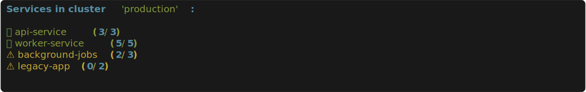

# lazy-ecs

[](https://pypi.org/project/lazy-ecs/)
[](https://pypi.org/project/lazy-ecs/)
[](https://github.com/vertti/lazy-ecs/blob/main/LICENSE)
[](https://coveralls.io/github/vertti/lazy-ecs?branch=main)

A CLI tool for navigating AWS ECS clusters interactively.


## Why I Built This

When running services in ECS, I constantly needed to check:

- What exactly is running where?
- Is my service healthy?
- What parameters or environment variables got applied?
- What do the latest logs show - did the container start as expected?

The AWS ECS web console is confusing to navigate, with multiple clicks through different screens just to get basic information. The AWS CLI is powerful but verbose and requires memorizing complex commands.

**lazy-ecs** solves this with a simple, interactive CLI that lets you quickly drill down from clusters → services → tasks → containers with just arrow keys. It destroys the AWS CLI in usability for ECS exploration and debugging.

## Table of Contents

- [Features](#features)
- [Installation](#installation)
- [AWS Authentication](#aws-authentication)
- [Roadmap](#roadmap)
- [Development](#development)

## Features

### Navigation & Exploration

**Interactive cluster selection**

- Arrow key navigation through ECS clusters
- _Why it's great:_ AWS console requires multiple clicks through menus; AWS CLI requires memorizing cluster ARNs

**Service browsing with smart status indicators**

- Visual health indicators (✅ healthy, ⚠️ scaling, 🔴 over-scaled)
- Running/desired/pending task counts at a glance
- _Why it's great:_ AWS console hides task counts in separate tabs; requires mental math to determine service health



**Open in AWS console**

- One-key shortcut to open current resource in browser
- Works for clusters, services, and tasks
- _Why it's great:_ When you need the full AWS console, jump there instantly without manual navigation

### Container Inspection

**Container details**

- Name, image, CPU/memory configuration
- Environment variables and secrets (without exposing values)
- Port mappings and volume mounts
- _Why it's great:_ AWS console spreads this across multiple tabs; AWS CLI requires complex JSON parsing

**Log viewing with live tail**

- Display recent logs with timestamps
- Real-time streaming (tail -f style)
- CloudWatch filter patterns (include/exclude)
- _Why it's great:_ AWS console log viewer is slow and clunky; AWS CLI requires memorizing log group names and complex filter syntax

### Service & Task Debugging

**Force new deployment**

- Trigger service redeployment directly from CLI
- _Why it's great:_ AWS console requires navigating to service → Update → Force new deployment (3+ clicks)

**Service events**

- Display deployment events with chronological sorting
- Proper event categorization
- _Why it's great:_ AWS console shows events in reverse chronological order, making it hard to follow deployment progression

**Task events/history with smart analysis**

- Lifecycle events and failure reasons
- Automatic detection of common failures (OOM kills, timeouts, image pull failures)
- Shows desired vs actual task definition versions (spot outdated tasks immediately)
- _Why it's great:_ AWS console requires clicking into each failed task individually; no smart analysis of failure patterns; no easy way to spot version mismatches


**CloudWatch metrics**

- CPU/Memory utilization with current, average, and peak values
- _Why it's great:_ AWS console requires switching to CloudWatch tab, selecting metrics, configuring graphs


**Log group discovery**

- Automatically find relevant log groups for debugging
- _Why it's great:_ AWS console requires knowing the exact log group name; AWS CLI requires listing all log groups and filtering manually

**Task definition comparison**

- Compare any two task definition revisions side-by-side
- Interactive revision selection from recent history
- Color-coded diff showing images, environment variables, secrets, CPU/memory, ports, commands, entrypoints, and volume mounts
- _Why it's great:_ AWS console has no native comparison tool; developers must download JSON and use external diff tools to answer "what changed between versions?"


## Installation

### Homebrew

```bash
# Add the tap
brew tap vertti/lazy-ecs

# Install lazy-ecs
brew install lazy-ecs

# Run it
lazy-ecs
```

### pipx

[pipx](https://pipx.pypa.io/) installs Python CLI tools in isolated environments:

```bash
# Install pipx if you haven't already
python3 -m pip install --user pipx
python3 -m pipx ensurepath

# Install lazy-ecs
pipx install lazy-ecs

# Run it
lazy-ecs
```

### Docker

Run lazy-ecs using Docker without installing Python:

```bash
# With aws-vault (temporary credentials)
aws-vault exec your-profile -- docker run -it --rm \
  -e AWS_ACCESS_KEY_ID -e AWS_SECRET_ACCESS_KEY -e AWS_SESSION_TOKEN -e AWS_REGION \
  vertti/lazy-ecs

# With IAM credentials (long-lived)
docker run -it --rm \
  -e AWS_ACCESS_KEY_ID -e AWS_SECRET_ACCESS_KEY -e AWS_REGION \
  vertti/lazy-ecs

# With AWS credentials file
docker run -it --rm -v ~/.aws:/home/lazyecs/.aws:ro vertti/lazy-ecs

# With specific profile
docker run -it --rm -v ~/.aws:/home/lazyecs/.aws:ro -e AWS_PROFILE=your-profile vertti/lazy-ecs
```

**Pro tip:** Create an alias for easier usage:

```bash
# Add to your ~/.bashrc or ~/.zshrc
alias lazy-ecs-docker='docker run -it --rm -e AWS_ACCESS_KEY_ID -e AWS_SECRET_ACCESS_KEY -e AWS_SESSION_TOKEN -e AWS_REGION vertti/lazy-ecs'

# Then use with aws-vault
aws-vault exec your-profile -- lazy-ecs-docker
```

### From Source

```bash
# Clone and install with uv
git clone https://github.com/vertti/lazy-ecs.git
cd lazy-ecs
uv sync
uv run lazy-ecs
```

## AWS Authentication

lazy-ecs supports multiple ways to authenticate with AWS:

### 1. AWS Profile (--profile flag)

```bash
lazy-ecs --profile your-profile-name
```

### 2. Environment Variables

```bash
export AWS_DEFAULT_PROFILE=your-profile-name
lazy-ecs
```

### 3. AWS Vault

```bash
aws-vault exec Platform-Test.AWSAdministratorAccess -- lazy-ecs
```

### 4. Default Credentials Chain

lazy-ecs will automatically use the standard AWS credentials chain:

- Environment variables (AWS_ACCESS_KEY_ID, AWS_SECRET_ACCESS_KEY)
- AWS credentials file (~/.aws/credentials)
- IAM instance profile (when running on EC2)

## Roadmap

Features listed in priority order:

1. **Resource usage vs limits** - Show allocated vs actual CPU/memory with right-sizing recommendations
2. **Export task definition** - Save task definitions as JSON/YAML files
3. **Task placement details** - Display placement constraints and actual host placement
4. **Health check configuration** - Display health check settings and current status
5. **Download logs to file** - Export CloudWatch logs for offline analysis
6. **Sparkline visualization** - Unicode trend indicators for metrics
7. **Service deployment history** - Timeline of deployments with rollback options
8. **Security groups** - Display networking and security configuration
9. **Auto-scaling configuration** - Display scaling policies and current metrics
10. **Load balancer health** - Display target group health and routing
11. **Quick task failure reason** - Show failure reason inline without navigation
12. **Export container environment** - Save environment variables to .env file
13. **Multi-region support** - Work with ECS across AWS regions
14. **Service update (image tag)** - Deploy new image version from CLI
15. **Service update (environment)** - Update environment variables
16. **Multi-cluster support** - Compare resources across clusters
17. **Port forwarding** - Direct local connection to container ports
18. **Stop/restart single task** - Force restart individual tasks

## Development

### Prerequisites

Install tools with [mise](https://mise.jdx.dev/):

```bash
mise install
```

### Setup

```bash
# Install dependencies
uv sync

# Install pre-commit hooks (runs ruff formatting/linting on commit)
uv run pre-commit install
```

### Development Commands

```bash
# Run the CLI
uv run lazy-ecs

# Run tests
uv run pytest

# Format and lint code (with type annotation enforcement)
uv run ruff format
uv run ruff check --fix

# Type checking with pyrefly
uv run pyrefly check

# Auto-add missing type annotations
uv run pyrefly infer

# Run tests with coverage
uv run pytest --cov
```

See [CLAUDE.md](CLAUDE.md) for detailed development guidelines.
